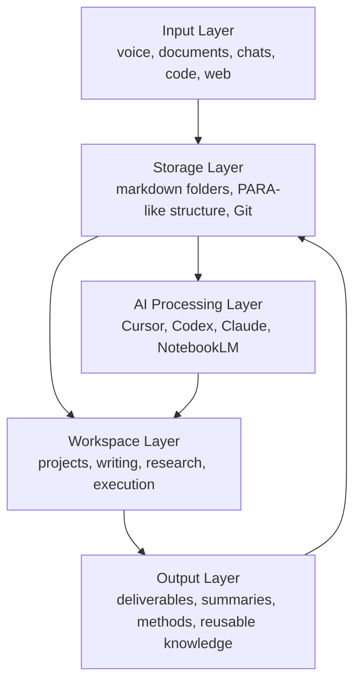

# Personal OS Architecture

`Second Brain Blueprint` is the public starter kit. **Personal OS** is the conceptual model behind it.

The idea is simple: your notes, projects, tools, and AI workflows should behave like one operating framework instead of a pile of disconnected apps.

## Layered Model

## Interpretation

- **Input Layer** captures what would otherwise disappear.
- **Storage Layer** turns scattered material into organized markdown memory.
- **AI Processing Layer** helps route, summarize, distill, and scaffold.
- **Workspace Layer** is where real work happens.
- **Output Layer** feeds the best results back into the system as reusable context.

## Why This Works

The system is not trying to replace every tool. It is trying to make them cooperate.

That is why the guiding principle is:

> Build the glue layer. Reuse the rest.

## Recommended Public-Safe Tools

- Markdown editor
- Git hosting
- Optional Obsidian graph view
- Optional cloud sync
- Optional AI tools for distillation and planning

## Related Files

- [../Guides/GETTING_STARTED.md](../Guides/GETTING_STARTED.md)
- [../Guides/WORKFLOW.md](../Guides/WORKFLOW.md)
- [../Rules/GLUE-DONT-BUILD.md](../Rules/GLUE-DONT-BUILD.md)
