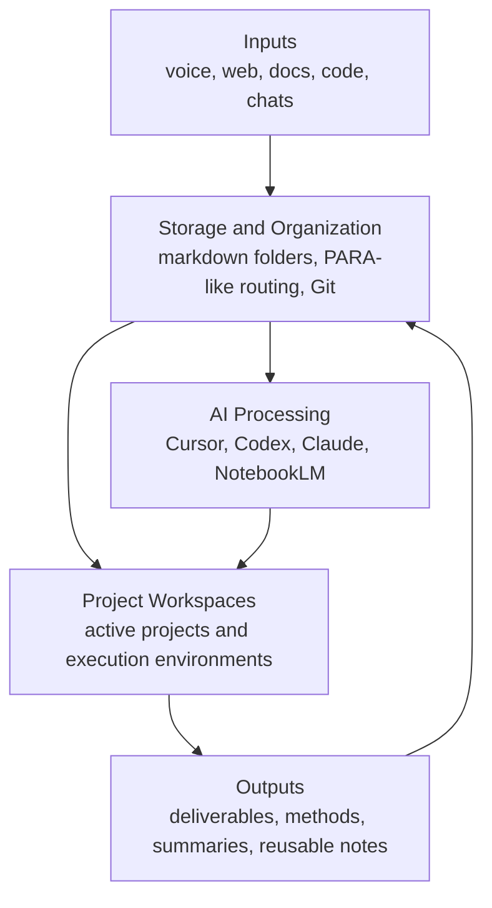

# Second Brain Blueprint

> 🧭 A markdown-first second-brain starter kit for building a Personal OS with AI.

`Second Brain Blueprint` is a sanitized, open-source starter kit for people who want a lightweight, AI-friendly personal knowledge system without locking themselves into a heavy app stack.

In this repo, **Personal OS** is a metaphor, not a literal operating system. It means a repeatable way to organize your notes, projects, tools, prompts, reviews, and AI workflows so they reinforce each other over time.

## ✨ Paste This Into Cursor / Codex / Claude

```text
I am using the Second Brain Blueprint starter kit as the base for my personal knowledge system.

Please help me adapt it to my life and work:
1. Rename folders, examples, and templates to fit my context.
2. Keep the system markdown-first and Git-friendly.
3. Preserve the Personal OS idea: inputs, storage, AI processing, project workspaces, and reusable outputs.
4. Suggest what should remain generic, what should be personalized, and what should stay private.
5. Do not over-engineer new tools if an existing markdown, Git, or cloud workflow already solves the problem.

Start by reviewing the README, 99_System/Guides/GETTING_STARTED.md, and 99_System/Maps/PERSONAL-OS.md.
Then propose a minimal customized version for me.
```

## 👀 What This Is

- A **starter kit**, not a vault dump
- A **markdown-first** knowledge workflow
- A **Personal OS** framework for organizing inputs, work, and reusable knowledge
- A repo that works on **GitHub alone**, even if you never open Obsidian
- A friendly base for **Cursor, Codex, Claude, NotebookLM, and Git**

## 🚫 What This Is Not

- Not a complete life dashboard product
- Not a replacement for every app you already use
- Not a prescription to rebuild Google Drive, Git, or note editors from scratch
- Not a public dump of private notes, chat logs, or real project files

## 🚀 Quick Start

1. Fork or clone this repository.
2. Read [99_System/Guides/GETTING_STARTED.md](./99_System/Guides/GETTING_STARTED.md).
3. Replace the synthetic examples with your own notes.
4. Adapt the templates in [99_System/Templates](./99_System/Templates/).
5. Keep the structure simple until you actually feel friction.
6. Use AI to help you scaffold, organize, distill, and review, not to invent needless complexity.

## 🧠 Architecture Preview



For the full version, see [99_System/Maps/PERSONAL-OS.md](./99_System/Maps/PERSONAL-OS.md) and [99_System/Maps/PERSONAL-OS.canvas](./99_System/Maps/PERSONAL-OS.canvas).

## 🔁 Core Method

The system is intentionally simple:

1. **Capture** new inputs before they disappear.
2. **Route** them into projects, areas, resources, or archive.
3. **Distill** messy work into clean notes, summaries, and methods.
4. **Reuse** what you learned through prompts, templates, and linked notes.
5. **Review** often enough that your system becomes living memory instead of dead storage.

## 🗂️ Folder Philosophy

- [00_Inbox](./00_Inbox/README.md): temporary landing zone for raw inputs
- [10_Projects](./10_Projects/README.md): time-bounded work with concrete outcomes
- [20_Areas](./20_Areas/README.md): ongoing domains you maintain over time
- [30_Resources](./30_Resources/README.md): references, ideas, and external knowledge
- [40_Archive](./40_Archive/README.md): inactive material worth keeping
- [50_Zettelkasten](./50_Zettelkasten/README.md): optional long-term idea layer
- [90_Attachments](./90_Attachments/README.md): supporting files and media
- [99_System](./99_System/README.md): rules, guides, maps, prompts, and templates
- [examples](./examples/README.md): synthetic sample notes that show the workflow

## 🧩 Glue, Don't Build

The philosophy behind this repo is **glue, don't build**.

Use mature tools for what they already do well:

- Use **Markdown** for durable notes.
- Use **Git** for versioned history.
- Use **Obsidian** for local graph browsing if you like it.
- Use **Google Drive** or another sync layer if it already fits your workflow.
- Use **NotebookLM** or similar tools for synthesis and presentation.
- Use **AI agents** to scaffold, summarize, route, and review.

Your custom work should stay in the **glue layer**:

- folder design
- naming rules
- prompts
- templates
- review rituals
- lightweight automation only when clearly needed

## 📝 Why Markdown

- Portable across tools and platforms
- Easy for AI systems to read and transform
- Friendly to Git diffs and version control
- Low lock-in compared with proprietary databases
- Good enough for both plain notes and structured workflows

## 🧼 What To Sanitize Before Public Sharing

If you fork this repo from your real knowledge system, remove or replace:

- private project names
- company or school references
- personal email addresses
- local file paths
- cloud hostnames and credentials
- screenshots with sensitive data
- raw AI chat logs that contain private context
- anything you would not want indexed publicly

## 📦 Suggested Customization Path

Start light:

1. Keep the folder structure.
2. Rename only what clearly mismatches your life.
3. Swap in your own templates gradually.
4. Add automation last, not first.

The best Personal OS is not the most complex one. It is the one you actually keep using.

## 📚 Repo Map

- Getting started: [99_System/Guides/GETTING_STARTED.md](./99_System/Guides/GETTING_STARTED.md)
- Workflow: [99_System/Guides/WORKFLOW.md](./99_System/Guides/WORKFLOW.md)
- Public sharing checklist: [99_System/Guides/SANITIZATION_CHECKLIST.md](./99_System/Guides/SANITIZATION_CHECKLIST.md)
- Architecture: [99_System/Maps/PERSONAL-OS.md](./99_System/Maps/PERSONAL-OS.md)
- Templates: [99_System/Templates](./99_System/Templates/)
- Rules: [99_System/Rules](./99_System/Rules/)
- Prompts: [99_System/Prompts](./99_System/Prompts/)
- Examples: [examples](./examples/README.md)

## 📄 License

MIT. See [LICENSE](./LICENSE).
