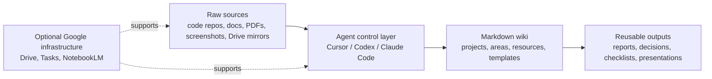
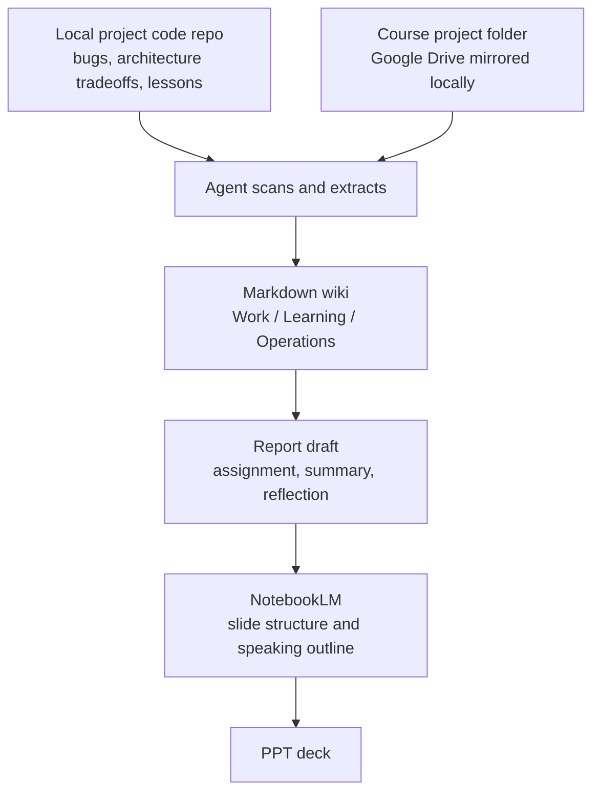

# Second-Brain-Blueprint

[Read in Chinese](README.zh-CN.md)

🧠 Second-Brain-Blueprint is a public-safe starter for an AI-maintained second brain.

Think of it less like a folder dump and more like a small knowledge workshop:

- raw material comes in
- agents help sort and extract it
- Markdown notes preserve the durable judgment
- future projects become easier because past work stays reusable

It is designed to be cloned, forked, and opened directly in Cursor, Codex, or Claude Code without exposing personal identity, immigration status, finances, contacts, or other private material.

## 🌍 Language Switch

- English: `README.md`
- Chinese: `README.zh-CN.md`

Technical paths, folder names, and control-layer filenames stay in English.
Your actual note content can be English, Chinese, or mixed.

## 🧠 What This Repo Actually Is

This repo is a starter template for knowledge workers who want a second brain that stays usable over time.

The default stack is:

- Markdown for the durable knowledge layer
- agents for the control layer
- optional Google tools for reusable infrastructure
- optional dashboard for display and ritual, not for first-run setup

## ✨ What A Real Second Brain Feels Like

A good second brain is not:

- a pile of raw files
- a folder of chat transcripts
- a one-shot RAG question-answer setup
- a dashboard-first product

A useful second brain feels more like this:

- 📥 sources remain traceable instead of disappearing into chat history
- 🧱 notes accumulate instead of resetting every session
- 🧭 decisions become reusable memory
- 🔁 projects continuously feed areas and resources
- 📈 the system gets better because maintenance compounds

The durable asset is the Markdown wiki.
The agent is the operator, not the memory itself.

## 🏗️ Architecture Layers



Layer by layer:

- Raw sources: the evidence layer. These are documents, screenshots, PDFs, recordings, exports, local folders, and external repositories.
- Markdown wiki: the durable memory layer. This repo is where notes, synthesis, templates, and operating rules live.
- Cursor / Codex / Claude Code: the control layer. Agents help ingest, query, restructure, lint, and maintain the wiki.
- Google Drive / Google Tasks / NotebookLM: reusable infrastructure. Helpful defaults, but not hard dependencies.

The key boundary is simple:

- agents are not the knowledge itself
- the wiki is the knowledge itself

## 🚀 Minimum Startup

You do not need Node or the dashboard to start using this repo.

1. Clone or fork the repository.
2. Open it in Cursor, Codex, or Claude Code.
3. Read `README.md` or `README.zh-CN.md`.
4. Open `DASHBOARD.md`, `INDEX.md`, and one of the starter areas.
5. Run one starter prompt and let the agent instantiate your private working copy.

Start here:

- `00_Inbox/`
- `10_Projects/`
- `20_Areas/Work/`
- `20_Areas/Learning/`
- `20_Areas/Operations/`
- `99_System/Guides/WORKFLOW.md`

## 🔄 Example Workflow: From Codebase To Report To PPT

One practical usage pattern looks like this:



### Scenario 1: A local project codebase teaches you something valuable

Suppose you already have a code repository on your machine.
Open a workspace that contains both:

- this second-brain repo
- your local code repo

Then ask the agent to:

- scan the codebase
- extract architecture decisions, bug lessons, workflow lessons, and reusable patterns
- promote those lessons into `10_Projects/`, `20_Areas/Work/`, or `30_Resources/`

Example prompt:

```text
Read this second-brain repo and the local code repository in the same workspace.
Extract the main engineering lessons, architecture tradeoffs, debugging patterns, and reusable workflows from the code repo.
Write the durable takeaways back into the Markdown wiki without copying private code into the public template.
Promote the best lessons into Work, Learning, or Resources.
```

### Scenario 2: A course assignment can reuse those lessons

Suppose you also have a course project folder mirrored locally from Google Drive.
Add that folder into the workspace too.

Now the agent can:

- read the course files
- pull in relevant lessons already stored in the second brain
- synthesize a report draft faster
- connect evidence, prior project experience, and current assignment requirements

Example prompt:

```text
Use the course project folder in this workspace together with the notes already stored in the second brain.
Identify which prior engineering lessons are relevant.
Draft a report structure, map evidence to each section, and suggest what should become a durable note afterward.
```

### Scenario 3: Google tools accelerate the output layer

After the report is drafted:

- keep the durable version in Markdown
- use NotebookLM to quickly review the report and source packet
- turn the report into a presentation outline
- finalize the PPT in your preferred slide workflow

In this pattern:

- the code repo is a source
- the course folder is a source
- the second brain holds the reusable memory
- the agent performs the extraction and transfer
- Google tooling helps package the output faster

## 🎛️ Control Layer: Cursor / Codex / Claude Code

This starter supports three agent entrypoints with one shared kernel:

- Cursor: `.cursor/rules/00-core.mdc` and `.cursor/rules/10-wiki-maintenance.mdc`
- Codex and general agents: `AGENTS.md`
- Claude Code: `CLAUDE.md`
- Shared operating rules: `99_System/Agent-Kernel.md`

Starter prompt for Cursor:

```text
Read README.md, PRIVACY.md, AGENTS.md, and 99_System/Agent-Kernel.md.
Treat this repo as a public starter, not as a personal vault.
Instantiate a private working copy for me using the existing framework.
Keep Work / Learning / Operations as the starter areas unless I ask to change them.
Do not add private identity, immigration, finance, or contact-network data to the public template.
Start from DASHBOARD.md and 00_Inbox/, then propose the first safe setup tasks.
```

Starter prompt for Codex:

```text
Use this repository as a public-safe second-brain starter.
Read README.md, PRIVACY.md, AGENTS.md, and 99_System/Agent-Kernel.md first.
Set up my private instance on top of this framework layer.
Preserve the Markdown-first workflow and treat agents as the control layer.
Do not write private personal data back into the public template.
Use Work, Learning, and Operations as the default starter areas.
```

Starter prompt for Claude Code:

```text
Read README.md, PRIVACY.md, CLAUDE.md, and 99_System/Agent-Kernel.md.
Help me derive a private second-brain instance from this public starter.
Keep the public framework layer clean and generic.
Use Markdown as the durable memory layer and treat the agent as the control layer.
Start with DASHBOARD.md, INDEX.md, and the starter areas, then suggest the smallest useful next setup step.
```

## ☁️ Google Reuse: Infrastructure And Methodology

Google tooling is documented here because it is easy to reuse:

- Google Drive for source storage
- Google Tasks for next actions
- NotebookLM for source-grounded review

But this repo does not require Google tooling to make sense.

You can still use the starter with:

- local folders
- plain Markdown
- local screenshots and exports
- agent-only workflows

Google is treated as reusable infrastructure, not as the definition of the system.

## 🖥️ Optional Dashboard

The React dashboard is optional.

It is useful if you want a visual layer for status, next actions, and lightweight ritual.
It is not required for first-run onboarding.

Run it only if you want it:

```bash
cd dashboard
npm install
npm run dev
```

Runtime requirements:

- Node `>=22 <23`
- npm `>=10 <11`

## 🔒 Privacy Boundary

This public repo is the framework layer.
Your real usage should live in a private instance layer.

Framework layer:

- folder structure
- templates
- starter notes
- agent rules
- generic sample data

Instance layer:

- your identity
- your projects
- your personal documents
- your contact network
- your scores, finances, health, legal, or immigration data

Read `PRIVACY.md` before publishing changes from a real working copy.

## 🚫 What This Is Not

- Not a public dump of personal life data
- Not a dashboard-first PKM product
- Not a warehouse for random files with no maintenance loop
- Not tied to a single AI vendor
- Not useful only if you also adopt Google tools

## 📍 Core Entry Files

- `README.md`
- `README.zh-CN.md`
- `DASHBOARD.md`
- `INDEX.md`
- `PRIVACY.md`
- `AGENTS.md`
- `CLAUDE.md`
- `99_System/Agent-Kernel.md`
- `99_System/Guides/WORKFLOW.md`
- `99_System/Guides/QUICK_REFERENCE.md`

## ♻️ License And Reuse

Use this repo as a starter and adapt it into your own private second brain.

Keep the framework public-safe.
Keep your instance private by default.
