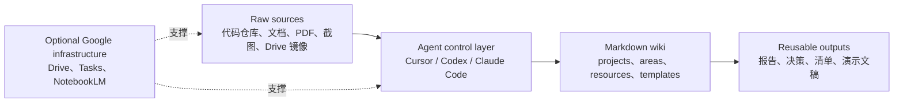
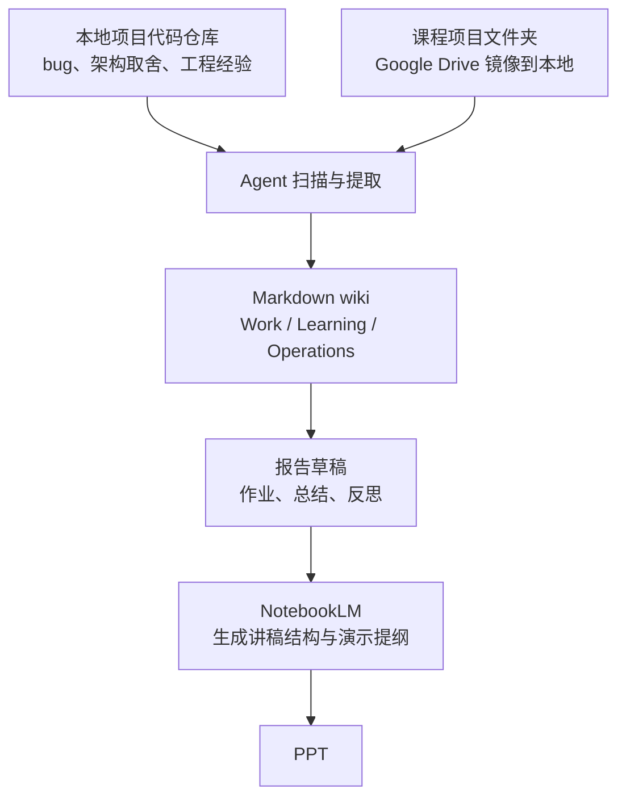

# Second-Brain-Blueprint

[Read in English](README.md)

🧠 `Second-Brain-Blueprint` 是一个可公开发布、可直接 fork / clone 的 AI second brain starter。

你可以把它理解成一个“小型知识工坊”，而不是一个资料坟场：

- 原始材料不断流入
- agent 负责整理、提取、迁移
- Markdown 笔记保存真正可复用的判断
- 未来的项目会因为过去留下的经验而越来越轻松

它的目标不是公开你的私人第二大脑，而是提供一个安全、清晰、即开即用的起步骨架，让你可以直接在 Cursor、Codex 或 Claude Code 中搭建自己的私有实例。

## 🌍 中英文切换

- English: `README.md`
- 中文: `README.zh-CN.md`

目录名、文件名、控制层入口名保持英文。
你自己的笔记内容可以是中文、英文，或者中英混合。

## 🧠 这到底是什么

这个仓库是一个面向知识工作者的 second brain starter template。

默认工作方式是：

- 用 Markdown 承载长期记忆层
- 用 agent 承载控制层
- 用可选的 Google 工具承载可复用基础设施
- 保留一个可选 dashboard 作为展示层和仪式层，但不是最低启动依赖

## ✨ 一个真正有用的第二大脑，应该是什么感觉

第二大脑不是：

- 一堆原始文件的堆积
- 聊天记录存档库
- 一次性的 RAG 问答壳子
- 先做 dashboard 再补内容的产品

一个有用的第二大脑，更像这样：

- 📥 source 永远有出处，不会丢进聊天窗口后就消失
- 🧱 笔记会持续积累，而不是每次从零开始
- 🧭 决策会沉淀成以后还能复用的记忆
- 🔁 项目经验会持续反馈到 area 和 resource
- 📈 系统会因为长期维护而不断增值

真正长期有价值的资产是 Markdown wiki。
agent 是操作员，不是知识本体。

## 🏗️ 架构分层



逐层来看：

- Raw sources：证据层。包括文档、截图、PDF、录音、导出文件、本地文件夹、外部代码仓库等。
- Markdown wiki：长期记忆层。这个 repo 主要保存笔记、综合、模板和操作规则。
- Cursor / Codex / Claude Code：控制层。agent 负责 ingest、query、restructure、lint、maintenance。
- Google Drive / Google Tasks / NotebookLM：可复用基础设施。很好用，但不是模板成立的前提。

最重要的边界只有一条：

- agent 不是知识本体
- wiki 才是知识本体

## 🚀 最低启动路径

你不需要先装 Node，也不需要先跑 dashboard，就可以开始使用。

1. Clone 或 fork 这个仓库。
2. 用 Cursor、Codex 或 Claude Code 打开。
3. 阅读 `README.md` 或 `README.zh-CN.md`。
4. 打开 `DASHBOARD.md`、`INDEX.md`，以及一个 starter area。
5. 执行一条 starter prompt，让 agent 帮你实例化自己的私有工作副本。

建议先从这些入口开始：

- `00_Inbox/`
- `10_Projects/`
- `20_Areas/Work/`
- `20_Areas/Learning/`
- `20_Areas/Operations/`
- `99_System/Guides/WORKFLOW.md`

## 🔄 一个非常实用的工作流：从代码仓库到报告再到 PPT

这套 second brain 很适合下面这种真实使用场景：



### 场景 1：本地代码仓库里的经验，快速迁移进第二大脑

假设你本地已经有一个项目代码库。
你可以把下面两类内容放进同一个 workspace：

- 这个 second brain repo
- 你的本地项目代码 repo

然后让 agent 去做这些事：

- 扫描代码库
- 提取架构决策、踩坑经验、调试模式、可复用流程
- 把这些经验提升成 `10_Projects/`、`20_Areas/Work/` 或 `30_Resources/` 里的长期笔记

示例提示词：

```text
Read this second-brain repo and the local code repository in the same workspace.
Extract the main engineering lessons, architecture tradeoffs, debugging patterns, and reusable workflows from the code repo.
Write the durable takeaways back into the Markdown wiki without copying private code into the public template.
Promote the best lessons into Work, Learning, or Resources.
```

### 场景 2：课程作业可以直接复用这些经验

再假设你有一个课程项目文件夹，来自 Google Drive，并且已经镜像到了本地目录。
你也把它加入 workspace。

这时候 agent 就可以：

- 读取课程文件和任务要求
- 调用你第二大脑里已经沉淀好的相关经验
- 更快生成报告草稿
- 把“当前材料 + 过去项目经验 + 课程要求”连接起来

示例提示词：

```text
Use the course project folder in this workspace together with the notes already stored in the second brain.
Identify which prior engineering lessons are relevant.
Draft a report structure, map evidence to each section, and suggest what should become a durable note afterward.
```

### 场景 3：Google 生态加速输出层

当报告草稿已经出来之后，你可以这样继续：

- 把可长期复用的版本保留在 Markdown wiki 里
- 用 NotebookLM 快速阅读 report 和 source packet
- 让 NotebookLM 帮你整理讲稿结构和演示提纲
- 最后再进入你熟悉的 PPT 工作流完成演示稿

在这个模式里：

- 代码仓库是 source
- 课程项目文件夹也是 source
- second brain 保存的是可复用记忆
- agent 负责提取、迁移、组织
- Google 工具帮助你更快完成输出包装

## 🎛️ 控制层：Cursor / Codex / Claude Code

这个 starter 用“三套入口、同一内核”的方式组织控制层：

- Cursor：`.cursor/rules/00-core.mdc` 和 `.cursor/rules/10-wiki-maintenance.mdc`
- Codex / 通用 agent：`AGENTS.md`
- Claude Code：`CLAUDE.md`
- 共享规则源：`99_System/Agent-Kernel.md`

Cursor 启动提示词：

```text
Read README.md, PRIVACY.md, AGENTS.md, and 99_System/Agent-Kernel.md.
Treat this repo as a public starter, not as a personal vault.
Instantiate a private working copy for me using the existing framework.
Keep Work / Learning / Operations as the starter areas unless I ask to change them.
Do not add private identity, immigration, finance, or contact-network data to the public template.
Start from DASHBOARD.md and 00_Inbox/, then propose the first safe setup tasks.
```

Codex 启动提示词：

```text
Use this repository as a public-safe second-brain starter.
Read README.md, PRIVACY.md, AGENTS.md, and 99_System/Agent-Kernel.md first.
Set up my private instance on top of this framework layer.
Preserve the Markdown-first workflow and treat agents as the control layer.
Do not write private personal data back into the public template.
Use Work, Learning, and Operations as the default starter areas.
```

Claude Code 启动提示词：

```text
Read README.md, PRIVACY.md, CLAUDE.md, and 99_System/Agent-Kernel.md.
Help me derive a private second-brain instance from this public starter.
Keep the public framework layer clean and generic.
Use Markdown as the durable memory layer and treat the agent as the control layer.
Start with DASHBOARD.md, INDEX.md, and the starter areas, then suggest the smallest useful next setup step.
```

## ☁️ Google 复用：基础设施，而不是本体

这里保留 Google 相关说明，是因为它们非常适合被复用：

- Google Drive 适合做 source storage
- Google Tasks 适合做 next actions 层
- NotebookLM 适合做 source-grounded review

但这个仓库并不依赖 Google 才能成立。

你完全可以只用这些方式启动：

- 本地文件夹
- 纯 Markdown
- 本地截图和导出文件
- 只依赖 agent 的工作流

这里的 Google 是“推荐复用基础设施”，不是“系统本体”。

## 🖥️ 可选 Dashboard

React dashboard 是可选层。

如果你希望有一个可视化状态页、next actions 页、轻量仪式层，它会很有帮助。
但它不是最低启动路径的一部分。

只有在你需要时再运行它：

```bash
cd dashboard
npm install
npm run dev
```

运行要求：

- Node `>=22 <23`
- npm `>=10 <11`

## 🔒 隐私边界

这个公开仓库是 framework layer。
你的真实使用应该落在 private instance layer。

Framework layer 包含：

- 目录结构
- 模板
- starter notes
- agent 规则
- 通用样例数据

Instance layer 包含：

- 你的身份信息
- 你的真实项目
- 你的个人文档
- 你的联系人网络
- 你的分数、财务、健康、法律、移民等敏感数据

从真实工作副本发布内容之前，先阅读 `PRIVACY.md`。

## 🚫 这不是什么

- 不是个人隐私公开仓
- 不是 dashboard-first 的 PKM 产品
- 不是只会堆文件、不做维护闭环的资料库
- 不是绑定某一家 AI 厂商的工作流
- 不是必须依赖 Google 才成立的系统

## 📍 核心入口文件

- `README.md`
- `README.zh-CN.md`
- `DASHBOARD.md`
- `INDEX.md`
- `PRIVACY.md`
- `AGENTS.md`
- `CLAUDE.md`
- `99_System/Agent-Kernel.md`
- `99_System/Guides/WORKFLOW.md`
- `99_System/Guides/QUICK_REFERENCE.md`

## ♻️ 复用方式

把这个仓库当作 starter 来用，再在你自己的私有实例中继续生长。

保持 framework layer 可公开。
保持 instance layer 默认私有。
